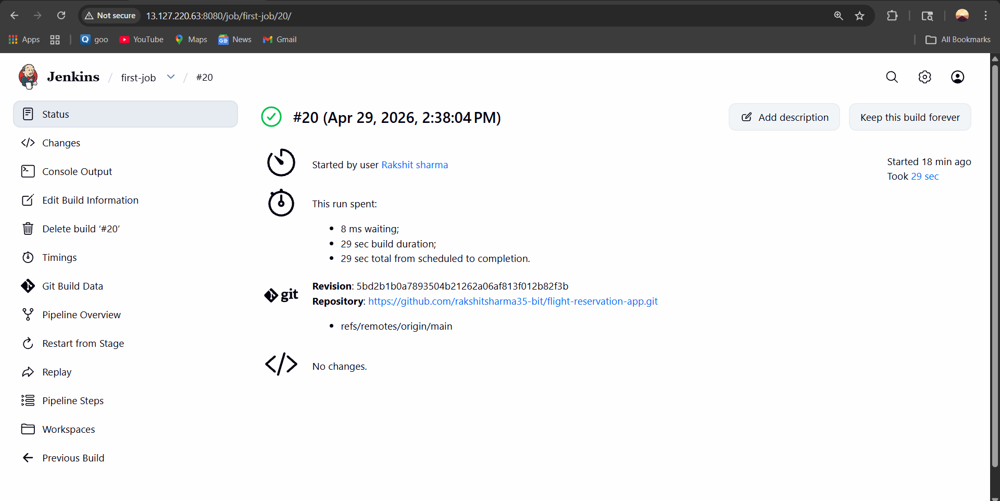
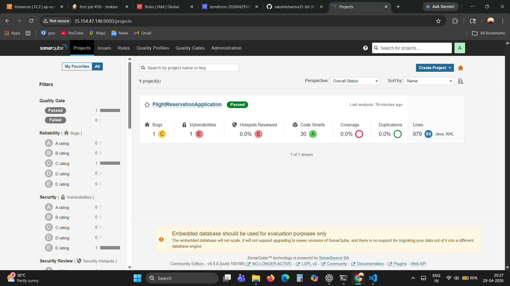
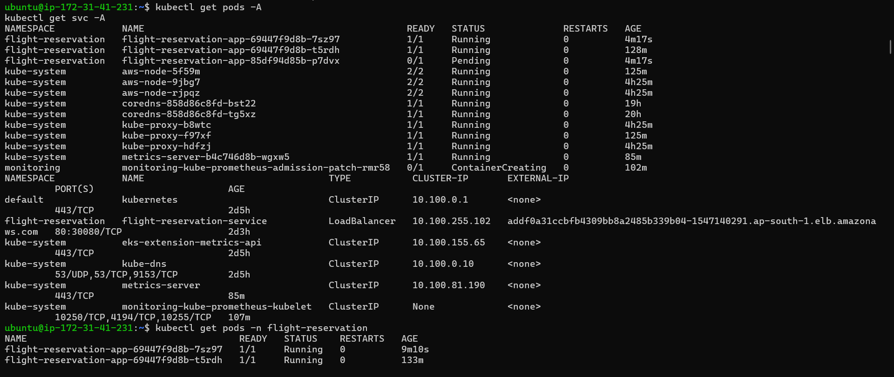

🚀 Flight Reservation App – CI/CD Pipeline on AWS EKS
📌 Project Overview

This project demonstrates an end-to-end CI/CD pipeline for a Spring Boot-based Flight Reservation application. The pipeline automates build, code quality analysis, containerization, and deployment to Kubernetes (AWS EKS).

The goal of this project is to showcase real-world DevOps practices including pipeline automation, containerization, and cloud deployment.

🏗️ Architecture
GitHub → Jenkins → Maven Build
        → SonarQube Analysis (Quality Gate)
        → Docker Build & Push (DockerHub)
        → AWS EKS Deployment (kubectl)

⚙️ Tech Stack
(1) CI/CD: Jenkins (Declarative Pipeline)
(2) Build Tool: Maven
(3) Code Quality: SonarQube
(4) Containerization: Docker
(5) Orchestration: Kubernetes (AWS EKS)
(6) Cloud: AWS (EKS, EC2, RDS)
(7) Version Control: Git & GitHub

🔄 CI/CD Pipeline Stages
(1) Clone Repository
(2) Pulls latest code from GitHub
(3) Build
(4) Compiles application using Maven
(5) Skips tests for faster execution
(6) SonarQube Analysis
(7) Performs static code analysis
(8) Ensures code quality standards
(9) Quality Gate
(10) Pipeline proceeds only if quality checks pass
(11) Docker Build
(12) Builds Docker image of the application
(13) Docker Push
(14) Pushes image to DockerHub repository
(15) Update Kubeconfig
(16) Connects Jenkins to AWS EKS cluster
(17) Deploy to EKS
(18) Deploys application using Kubernetes manifests

 📸 Screenshots

 ✅ Jenkins Pipeline Success

 ✅ SonarQube Quality Gate

 ✅ Kubernetes Pods Running

📦 Kubernetes Deployment
Namespace: flight-reservation
Deployment: flight-reservation-app
Service Type: LoadBalancer

▶️ How to Run (Basic)
# Build application
mvn clean install

# Build Docker image
docker build -t <your-docker-username>/flight-app .

# Push image
docker push <your-docker-username>/flight-app

# Deploy to Kubernetes
kubectl apply -f k8s/

🎯 Key Learnings
(1) Implemented Pipeline as Code using Jenkins
(2) Integrated SonarQube Quality Gates
(3) Automated Docker image build & push
(4) Deployed application to AWS EKS
(5) Managed Kubernetes resources (Deployment, Service, Secrets)

🚀 Future Improvements
(1) Helm chart integration
(2) Automated rollback strategy
(3) Monitoring using Prometheus & Grafana
(4) CI/CD pipeline optimization

⭐ Final Note

This project is built for learning and demonstration purposes, focusing on practical DevOps implementation rather than production-level optimization